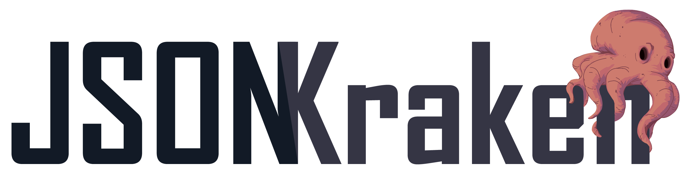

[](https://travis-ci.org/zogar1993/jsonkraken)
[](https://coveralls.io/github/zogar1993/jsonkraken?branch=master)
[](https://app.codacy.com/app/zogar1993/jsonkraken?utm_source=github.com&utm_medium=referral&utm_content=zogar1993/jsonkraken&utm_campaign=Badge_Grade_Settings)
[](http://search.maven.org/#search|ga|1|jsonkraken)

## What is JSONKraken?

JSONKraken is a fully compliant, pretty optimized, idiomatic JSON parser. It is written in Kotlin for the Java Virtual Machine.

## Why should I care?

- If you are looking to map POJOs, then this may not be for you.
- If *obj.getJsonObject("captain").getJsonString("name")* does not seem really verbose to you and does not make you want to cry, then your time is better spent elsewhere.
- On the other hand, if you prefer *obj["captain"]["name"].cast<String>()* you may want to keep reading.

## Why another JSON parsing library?

* Flexibility: Not being focused on mapping JSON to predefined entities but to dinamically access any field is great for some uses. Maybe an entity is too much work for your needs, or like in my case, the entity you are trying to map is a construct which does not exist until runtime.
* Kotlin Friendly: Using get and set operators in Kotlin is as idiomatic as I can imagine it to be, untainted by verbose semantics.
* Lightweightness: Is this a word? The thing is it is as light as I could think it to be.
* Performance: Ok now, not to say other JSON parsers are not optimized, but i have seen only a few take into consideration that Java is a garbage ~~collected~~ language.
Its low level implications sometimes elude proper consideration.
* Possibility: I could, I did.

## Getting Started

I will get technical then, but first lets see a quick example.

### Hello world overview

```kotlin
val json: JsonValue = JsonKraken.deserialize("""{"getting":{"started":"Hello World"}}""")
println(JsonKraken.serialize(json)) //prints: {"getting":{"started":"Hello World"}}
println(json["getting"]["started"].cast<String>()) //prints: Hello World
```

### Dependency management

#### Gradle
**`build.gradle`**:
```gradle    
dependencies {
    compile "net.jemzart:jsonkraken:2.0.0"
}
```
#### Maven
**`pom.xml`**:
```xml
<dependencies>
    <dependency>
        <groupId>net.jemzart</groupId>
        <artifactId>jsonkraken</artifactId>    
        <version>2.0.0</version>
    </dependency>
</dependencies>
```

### Imports

Inside package *net.jemzart.jsonkraken* you may find:
- JsonKraken, useful for serialization, deserialization and transformation.
- All wrapped types, which are derived from JsonValue.

- - -

That pretty much covers the basics.
The rest of the document is for you, dear reader,
to better understand the details of JSONKraken.

- - -

## Parsing from String to JsonValue (Deserialization)

We use *JsonKraken.deserialize(data)* for String to JsonValue conversion.
In case of not being able to parse a symbol, a DeserializationException will be thrown.

## Parsing from Object to String (Serialization)

We use *JsonKraken.serialize(obj)* for Object to String conversion.
If *obj* is not a JsonValue, it will internally try to be converted into one before starting the serialization process.
Strings are generated without needless blank space, minimizing its size and readability.
We instead use *JsonKraken.serialize(obj, tabulation)* when we want the serialization to be tabulated.
To define which tabulation to apply, use *net.jemzart.jsonkraken.serializer.Tabulation*.

## JsonValue

A JsonValue is always a consistent json representation should it be serialized. This means it verifies the following in all its operations:

- Added an element, its type is valid (See [Valid Types](https://github.com/zogar1993/jsonkraken#valid-types)).
- Added a JsonValue, it does not provoke a circular reference.
- Added a String, it is compliant with the [JSON Specification](http://www.ecma-international.org/publications/files/ECMA-ST/ECMA-404.pdf).

In cases where the validation fails, an exception will be thrown.

#### Valid Types

- Boolean
- String
- Char
- Number
- JsonValue
- Map<\*,*>
- Iterable<\*>
- Array<\*>
- null

Some valid types shall be altered for consistency:
- A Number will be stored internally as its *toString()* representation.
- A Char will be converted to String.
- Map will be converted to JsonObject.
- Iterable will be converted to JsonArray.
- Array will be converted to JsonArray.


## JsonContainer

Both JsonArray and JsonObject can be created by parameterless constructors.

When constructing any of those, varargs are supported, which means you could:

```kotlin
JsonArray(1, "one", true)
JsonObject("key1" to 1, "key2" to "one", "key3" to true)
```

Or, if you use the spread operator you could even:

```kotlin
val array = arrayOf(1, "one", true)
JsonArray(*array)
val pairs = arrayOf("key1" to 1, "key2" to "one", "key3" to true)
JsonObject(*pairs)
```

You could also convert Iterables, Arrays and Maps the following way:

```kotlin
val obj = JsonKraken.transform<JsonObject>(mapOf("key1" to 1, "key2" to "one", "key3" to true))
val arr1 = JsonKraken.transform<JsonArray>(listOf(1, "one", true))
val arr2 = JsonKraken.transform<JsonArray>(arrayOf(1, "one", true))
```

A JsonValue has get and set operators so that you can do the following, provided foo is a JsonValue:

```kotlin
foo[0] = "bar"
println(foo[0].cast<String>()) //prints: bar
```

If you try to get an element which does not exist, an exception will be thrown.
	
Here are some other auxiliary methods and properties JsonValue has:

```kotlin
foo.remove(bar) //removes element at index/key bar
foo.clone() //performs a deep clone of the JsonValue
foo.size //returns the amount of elements in the JsonValue
```

## JsonObject

- When iterating over a JsonObject, each element of the iteration is a Map.Entry<String, JsonValue>.
- The *keys* property returns only its keys.
- You can guess on your own what the *values* property does.

## JsonArray

- When iterating over a JsonArray each element of the iteration is a JsonValue.
- The *add(element)* method allows you to add an element after the last one.
- The *insert(index, element)* method allows you to add an element at designated index,
 pushing all items from said to the last element, without replacing any.
- The *set(index, element)* operator allows you to replace an existing element.
 If said index is unused, indexes between the specified and the actual last of the JsonArray will be filled with JsonNull.
- Both *get* and *set* operators, *remove* and *insert* support reverse notation.

## Implementation details
###### (you should not need to know all of this, but maybe you do. It is here for a reason after all)

- Since numbers are stored as String internally, they do not lose precision.
- JsonValues get/set operators welcome both Integers and Strings as index/key.
An Integer will be converted to String in the case of JsonObject,
whereas a String will try to be converted to Int in JsonArray,
and will throw an Exception if the cast fails.
- Although JSON specification for objects does not prohibit duplicate keys,
JSONKraken (like every sane parser out there) does not support it.
Only the value of the last duplicate key will be stored when deserializing,
but no Exception will be thrown.
- Non tabulated serialization is optimized apart from its tabulated peers to maximize performance gain.
- Whole numbers will be serialized without its decimal part.
- -0 will be turned to 0 to avoid weird language behaviour with some primitive types.
- For your peace of mind, validations are not performed when not necessary
(like circular reference check on construction or type check on deserialization).

## Change Log

### 2.0.0

- Now JSON null, boolean, string and number are each represented by a JsonValue.
- No longer are unwrapped primitives stored inside JsonContainer, they get wrapped instead.
- Library extension methods no longer exist.
Use JsonKraken object instead for serialization, deserialization and transformation.
- Numbers are no longer internally stored as Double,
now they do not lose precision under any circumstance.
- Added *cast* method to JsonValue to ease its usage, making it less verbose and error prone.
- Added multiple tabulation options for when serializing.
- Refined error handling, throwing clearer and simpler exceptions.
- *references* method no longer available in JsonContainer.

### 1.2.0 [(Documentation)](https://github.com/zogar1993/jsonkraken/tree/v1.2)

- Removed empty spaces on formatted serialized empty collections.
- Now returns TokenExpectationException when deserialization finds premature end of String.
- Valid types now include Map, Iterable and Array.

#### 1.1.1

- Fixed bug when deserializing non fractional numbers with exponent.

#### 1.1.0

- Added reverse notation support for JsonArray *insert* and *remove* methods.
- Added json string validation for to all String insertions, since they where only validated when deserialized.
- Added json string validation for to all JsonObject parity keys.
- Added json string validation for lonely string serialization.
- Fixed bug when deserializing extreme numbers which would lead into an unwanted Exception.

#### 1.0.0

- Release the Kraken!